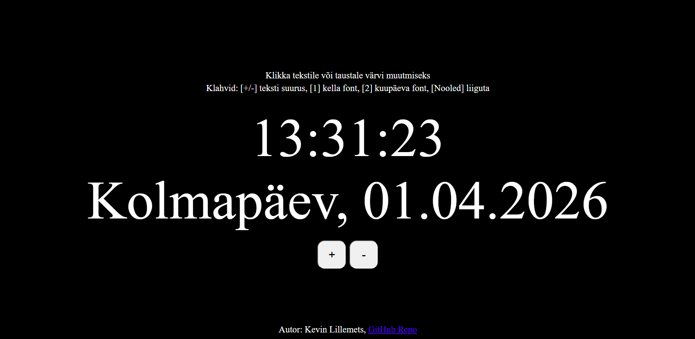
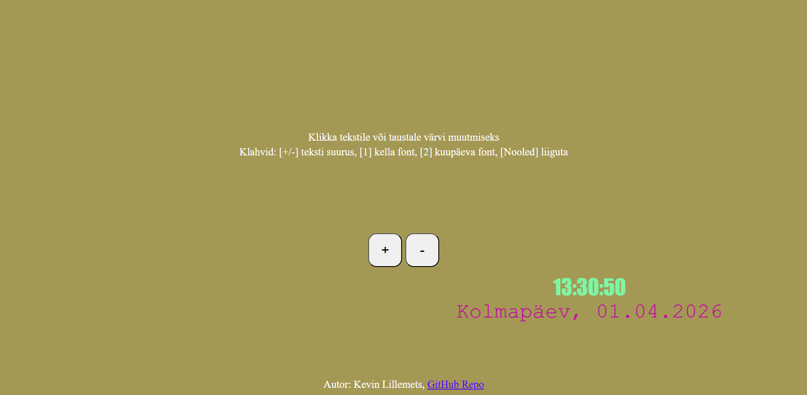

kodutoo-1, Kevin Lillemets

Võtsin töö aluseks varasemalt tunnis tehtud kella failid.
Lisasin järgmised funktsioonid: Teksti suureks/väikseks tegemine nupu ja klahvide abil (oli varasemalt olemas), kella ja kuupäeva fondi muutmine, tausta värvi muutmine taustale klikates, kella värvi muutmine kellale klikates, kuupäeva värvi muutmine kuupäevale klikates, kella ja kuupäeva liigutamine noolte abil. Lisasin ka väiksema funktsiooni, mis võttis suvalise värvi Mathi abil.

AI abi kasutasin kahe funktsiooni jaoks, mõlema jaoks andsin ette ka oma kella failid. Nendeks olid funktsioon getRandomColor ja funktsioon moveClock.

getRandomColor viibe: "Aita mul luua funktsioon, mis võtab suvalise värvi, mida ma saaksin kasutada oma tausta ja teksti värvi muutmisel nendele klikates."

moveClock viibe: "Aita mul luua funktsioon, mis liigutab kella. Kohanda selle jaoks ka CSS faili."